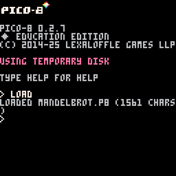

# Pico-8 Mandelbrot Viewer

## About

I put this together quickly after youtube showed me a [3B1B video short](https://www.youtube.com/watch?v=y9BK--OxZpY) from a year ago that finally clicked.

How to optimize this has not yet clicked!

I constrained myself to only use the [PICO-8 User Manual](https://www.lexaloffle.com/dl/docs/pico-8_manual.html) as reference. No googling, and definitely none of 'you know what', hence it runs at about 10 seconds per frame!

It's slower when there's a lot of 'black' in view, as these are regions that require the full number of iterations to confirm that they do not 'blow up' to infinity.

There's something very relaxing about coding in Pico-8 without the bells and whistles of VS code and the like.

## Installation/Usage

 - Download `src/mandelbrot.p8` to your computer
 - Visit the free [PICO-8 online editor](https://www.pico-8-edu.com/)
 - Click the big triangle 'Play' button
 - Type `load` followed by &lt;Enter&gt;
 - Choose the `mandelbrot.p8` file you downloaded
 - Type `run` followed by &lt;Enter&gt;

After a little while, a small portion of the mandelbrot set fractal should be rendered in 16 stunning colours at 127x127 resolution!

### Keyboard Controls

 - `Z` - zoom in
 - `X` - zoom out
 - `Q` - zoom right out to see the whole set
 - `←` - move left
 - `↑` - move up
 - `→` - move right
 - `↓` - move down

## Images

#### The big triangle play button:

#### Loading and running the `mandelbrot.p8` file:

#### The initial zoomed-in view:

#### The whole zoomed-out view:

## Comments

The code is self-commenting, right?

 - `c_mult` - multiply two complex numbers
 - `c_add` - add two complex numbers
 - `c_mag_sqr` - get the square of the magnitude of a complex number - i.e. the pythagorean distance fom 0+0i but stop short of taking the square root - this was about as far as I got with optimization!
 - `test` - test whether a given complex number will 'explode to infinity' by iterating $$z_{n+1}=z_n^2+c$$ stopping if $$c\_mag\_sqr(z)> 4$$ because that would be equivalent to checking if $$c\_mag(z)> 2$$ but without having to do a `sqrt()`
 - `map_px` - map an XY pixel screen coordinate to a location on the 'complex plane' based on current scale and center position
 - `draw` - for each pixel on the screen, map its position, test how many iterations it lasts without 'blowing up' and then map that number to a colour and draw it.
 - `_draw` - the Pico-8 draw-loop function always called every frame, so we check if anything was actually changed before doing anything.
 - `_update` - the Pico-8 draw-loop update function called every frame before `_draw` where we check if any buttons were pressed and update scale and position if so.
 - `move` - translate the view position
 - `zoom` - zoom the view in or out
 - `home` - zoom right out to see everything